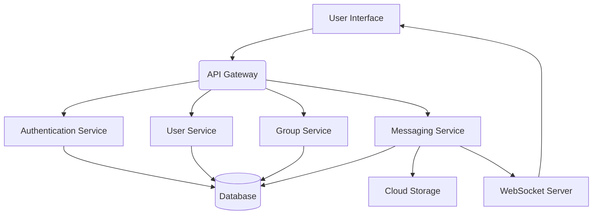

## GroupChat Software Architecture Document

**Version:** 1.0
**Date:** 2023-10-27

---

### 1. Introduction

This document outlines the high-level software architecture for GroupChat, a social networking application designed to facilitate group conversations around shared interests and hobbies. It details the system's components, their interactions, recommended technology stack, and key data flows.

---

### 2. Goals and Objectives

The primary goal of GroupChat is to provide a seamless and engaging platform for users to:

*   **Create and join group chats:** Based on common interests or hobbies.
*   **Communicate effectively:** Via text and multimedia messaging within groups.
*   **Discover and connect:** With like-minded individuals.
*   **Build communities:** Around shared passions.

---

### 3. System Components and Their Relationships

The GroupChat application will be composed of the following core components:

**3.1. User Interface (UI) / Frontend:**

*   **Description:** This is the client-side application that users interact with. It will be responsible for displaying chat messages, user profiles, group information, and handling user input.
*   **Key Responsibilities:**
    *   User authentication and authorization.
    *   Displaying chat history and real-time messages.
    *   Sending and receiving text and multimedia messages.
    *   Managing user profiles and group memberships.
    *   Facilitating group creation and invitation processes.
    *   Handling user interactions and navigation.
*   **Relationships:** Interacts with the API Gateway to fetch and send data.

**3.2. API Gateway:**

*   **Description:** A single entry point for all client requests. It acts as a facade, routing requests to the appropriate backend microservices. This component also handles cross-cutting concerns like authentication, rate limiting, and logging.
*   **Key Responsibilities:**
    *   Request routing to backend services.
    *   Authentication and authorization enforcement.
    *   Rate limiting and traffic management.
    *   API versioning.
    *   Centralized logging.
*   **Relationships:** Receives requests from the UI and forwards them to relevant backend services.

**3.3. User Service:**

*   **Description:** Manages all user-related data and operations.
*   **Key Responsibilities:**
    *   User registration and profile management (creation, updates, deletion).
    *   User authentication (login, logout).
    *   User search and retrieval.
    *   Managing user relationships (e.g., friends, blocked users - *future consideration*).
*   **Relationships:** Interacts with the Authentication Service for credentials and the Database for user data.

**3.4. Authentication Service:**

*   **Description:** Handles user authentication and authorization. It will issue and validate authentication tokens.
*   **Key Responsibilities:**
    *   User credential verification.
    *   Token generation (e.g., JWT).
    *   Token validation.
    *   Session management (optional, depending on token strategy).
*   **Relationships:** Interacts with the User Service for user verification and the API Gateway for token validation.

**3.5. Group Service:**

*   **Description:** Manages all group-related data and operations.
*   **Key Responsibilities:**
    *   Group creation, update, and deletion.
    *   Managing group memberships (joining, leaving, inviting, removing users).
    *   Retrieving group information and member lists.
    *   Handling group permissions and roles (e.g., admin, moderator - *future consideration*).
*   **Relationships:** Interacts with the User Service to validate members and the Database for group data.

**3.6. Messaging Service:**

*   **Description:** Handles the core functionality of sending, receiving, and storing chat messages. This service will likely leverage real-time communication technologies.
*   **Key Responsibilities:**
    *   Receiving new messages from users.
    *   Broadcasting messages to relevant group members in real-time.
    *   Storing message history.
    *   Handling multimedia message uploads and retrieval.
    *   Message delivery guarantees (e.g., at-least-once).
*   **Relationships:** Interacts with the WebSocket Server for real-time communication, the Database for message storage, and potentially a Cloud Storage service for multimedia.

**3.7. Real-time Communication (WebSocket Server):**

*   **Description:** Facilitates persistent, bi-directional communication between the server and clients for real-time message delivery.
*   **Key Responsibilities:**
    *   Establishing and managing WebSocket connections with clients.
    *   Receiving messages from the Messaging Service and broadcasting them to connected clients.
    *   Receiving messages from clients and forwarding them to the Messaging Service.
*   **Relationships:** Works closely with the Messaging Service.

**3.8. Cloud Storage Service (e.g., S3, Google Cloud Storage):**

*   **Description:** Used for storing and retrieving multimedia content (images, videos, files) shared within group chats.
*   **Key Responsibilities:**
    *   Securely storing uploaded multimedia files.
    *   Providing URLs or direct access to retrieve multimedia content.
*   **Relationships:** Accessed by the Messaging Service for multimedia uploads and retrieval.

**3.9. Database:**

*   **Description:** A persistent data store for all application data.
*   **Key Responsibilities:**
    *   Storing user profiles.
    *   Storing group information and memberships.
    *   Storing message history.
    *   Storing multimedia metadata.
*   **Relationships:** Accessed by User Service, Group Service, and Messaging Service.

---

**3.10. System Component Diagram:**

---

### 4. Technology Stack Recommendations

This section proposes a technology stack that balances scalability, performance, and developer productivity.

**4.1. Frontend:**

*   **Framework:** **React** or **Vue.js**. These frameworks offer a component-based architecture, efficient DOM manipulation, and a large ecosystem, making them suitable for building interactive UIs.
*   **State Management:** **Redux** (for React) or **Vuex** (for Vue.js). Essential for managing complex application state.
*   **Styling:** **CSS Modules**, **Styled-Components**, or a UI library like **Material-UI** or **Ant Design**.
*   **Real-time Communication:** **Socket.IO** or native **WebSockets** for client-side implementation.

**4.2. Backend:**

*   **Language/Framework:**
    *   **Node.js with Express.js or NestJS:** Excellent for building microservices, especially with its strong asynchronous capabilities, ideal for real-time applications.
    *   **Python with FastAPI or Django:** Offers a good balance of developer productivity and performance. FastAPI is highly performant and modern.
    *   **Go with Gin or Echo:** Known for its high performance and concurrency, making it suitable for high-throughput services.
*   **API Gateway:**
    *   **Kong API Gateway:** Open-source, feature-rich, and highly scalable.
    *   **AWS API Gateway** or **Google Cloud API Gateway:** Managed services offering ease of deployment and scaling.
*   **Authentication Service:**
    *   **JWT (JSON Web Tokens):** For stateless authentication.
    *   **OAuth 2.0 / OpenID Connect:** For secure authorization and potential integration with third-party providers in the future.
*   **Messaging Service & Real-time Communication:**
    *   **Node.js with Socket.IO:** A popular choice for real-time applications due to its ease of use and robust features.
    *   **Dedicated Real-time Messaging Platforms:** Consider services like **Pusher**, **Ably**, or **Firebase Realtime Database** for advanced real-time capabilities and scalability, especially if handling very high message volumes.
*   **Database:**
    *   **PostgreSQL:** A powerful, open-source relational database, suitable for structured data like user profiles and group information.
    *   **MongoDB:** A NoSQL document database, excellent for storing flexible, evolving data like chat messages, especially with its ability to handle large amounts of unstructured data. A hybrid approach might be considered.
    *   **Redis:** For caching frequently accessed data and managing session information.
*   **Cloud Storage:**
    *   **Amazon S3**
    *   **Google Cloud Storage**
    *   **Azure Blob Storage**
*   **Containerization & Orchestration:**
    *   **Docker:** For packaging applications into portable containers.
    *   **Kubernetes:** For automating deployment, scaling, and management of containerized applications.
*   **Message Queue (Optional, for decoupling services):**
    *   **RabbitMQ** or **Kafka:** For asynchronous communication between microservices, improving resilience and scalability.

---

### 5. Data Flow and Interactions

This section illustrates key data flows within the GroupChat application.

**5.1. User Registration:**

1.  **UI:** User submits registration form (username, email, password).
2.  **API Gateway:** Receives registration request, forwards to User Service.
3.  **User Service:** Validates input, hashes password, stores user data in Database.
4.  **Database:** Stores new user record.
5.  **User Service:** Returns success/failure response to API Gateway.
6.  **API Gateway:** Returns response to UI.

**5.2. User Login:**

1.  **UI:** User submits login credentials (email, password).
2.  **API Gateway:** Receives login request, forwards to Authentication Service.
3.  **Authentication Service:** Retrieves user from User Service (or directly from DB), verifies password.
4.  **Authentication Service:** If valid, generates a JWT token.
5.  **Authentication Service:** Returns JWT token to API Gateway.
6.  **API Gateway:** Returns JWT token to UI.
7.  **UI:** Stores JWT token for subsequent authenticated requests.

**5.3. Creating a Group:**

1.  **UI:** User initiates group creation, provides group name, description, and invites initial members.
2.  **API Gateway:** Receives create group request with authenticated user's token and group details.
3.  **API Gateway:** Validates token via Authentication Service.
4.  **API Gateway:** Forwards request to Group Service.
5.  **Group Service:** Creates new group in Database, adds creator as member, and adds invited members.
6.  **Database:** Stores new group record and membership entries.
7.  **Group Service:** Returns success/failure response to API Gateway.
8.  **API Gateway:** Returns response to UI.

**5.4. Sending a Text Message:**

1.  **UI:** User types and sends a text message in a group.
2.  **API Gateway:** Receives message request with JWT token, group ID, and message content.
3.  **API Gateway:** Validates token via Authentication Service.
4.  **API Gateway:** Forwards message to Messaging Service.
5.  **Messaging Service:**
    *   Validates user's membership in the group (optional, can be done by Group Service beforehand).
    *   Stores the message in the Database.
    *   Publishes the message to the WebSocket Server for real-time broadcast.
6.  **Database:** Stores the new message record.
7.  **WebSocket Server:** Receives message from Messaging Service, identifies connected clients in the target group, and broadcasts the message to them.
8.  **UI (Receiving Client):** Receives the message in real-time via WebSocket and displays it.

**5.5. Sending a Multimedia Message:**

1.  **UI:** User selects and uploads a multimedia file.
2.  **UI:** Sends the file to the API Gateway.
3.  **API Gateway:** Receives file upload request, forwards to Messaging Service.
4.  **Messaging Service:**
    *   Uploads the file to the Cloud Storage Service.
    *   Receives the file URL from Cloud Storage.
    *   Stores message metadata (including the file URL) in the Database.
    *   Publishes a message event (containing file URL and other details) to the WebSocket Server.
5.  **Cloud Storage Service:** Stores the multimedia file.
6.  **Database:** Stores the message metadata.
7.  **WebSocket Server:** Broadcasts the message event to connected clients.
8.  **UI (Receiving Client):** Receives the message event, retrieves the multimedia content using the provided URL (either directly or via API Gateway), and displays it.

---

### 6. Scalability and Performance Considerations

*   **Microservices Architecture:** Allows independent scaling of individual services based on their load.
*   **Load Balancing:** Implement load balancers at various layers (API Gateway, individual services) to distribute traffic.
*   **Database Sharding/Replication:** For handling large volumes of data and high read/write traffic.
*   **Caching:** Utilize Redis for caching frequently accessed data (user profiles, group details) to reduce database load.
*   **Asynchronous Operations:** Employ message queues for non-critical tasks to avoid blocking main request threads.
*   **Real-time Optimization:** Efficient WebSocket connection management and message broadcasting are crucial. Consider techniques like message batching.
*   **CDN for Media:** For serving multimedia content efficiently to users globally.

---

### 7. Security Considerations

*   **Authentication and Authorization:** Robust JWT-based authentication, secure password storage (hashing and salting), and role-based access control.
*   **Data Encryption:** Encrypt sensitive data at rest (database) and in transit (HTTPS/TLS).
*   **Input Validation:** Sanitize all user inputs to prevent injection attacks.
*   **Rate Limiting:** Protect against brute-force attacks and abuse.
*   **Secure File Uploads:** Implement checks for malicious file types and size limits.
*   **Regular Security Audits:** Conduct periodic security assessments.

---

### 8. Future Enhancements

*   **Push Notifications:** For notifying users of new messages when the app is not active.
*   **User Presence:** Indicating when users are online or typing.
*   **Search Functionality:** Enabling users to search for groups and messages.
*   **User Blocking and Reporting:** For community moderation.
*   **Rich Text Formatting:** Support for bold, italics, etc.
*   **File Sharing:** Beyond multimedia, allowing document and other file sharing.
*   **Video/Audio Calls:** Integration for real-time voice and video communication.
*   **Group Moderation Tools:** For group administrators.

---